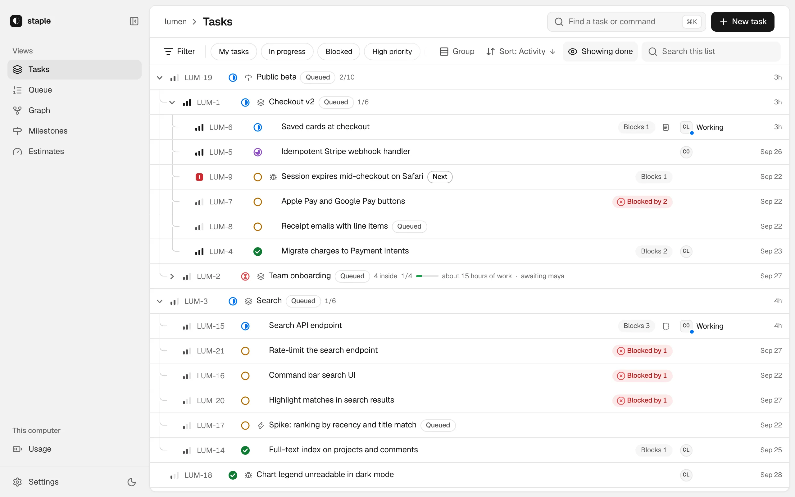
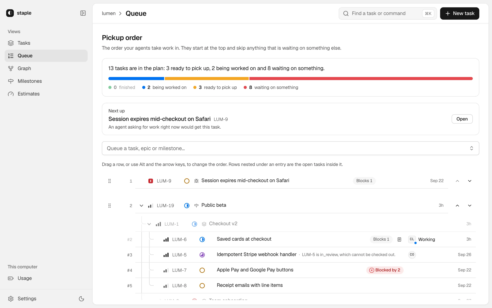
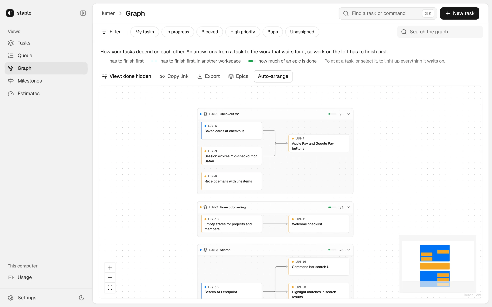
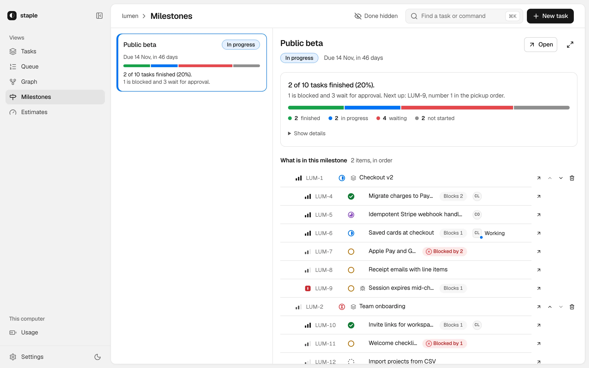
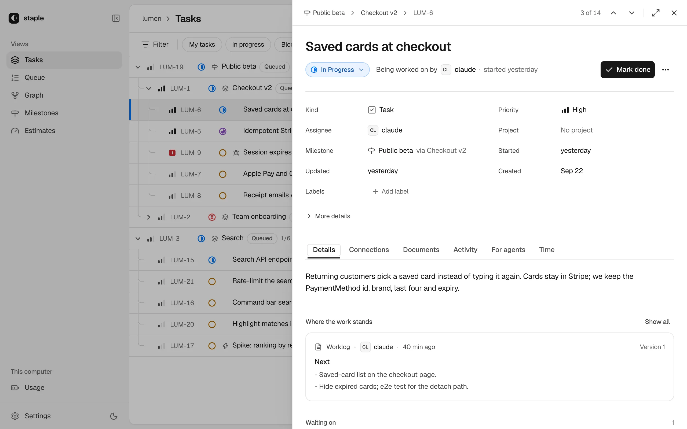

# Web UI tour

Use the web UI to see the whole plan at once and steer it: what is ready, what is
blocked, what agents hold and what needs you. It works on the same tickets as the
CLI and MCP, so a change made anywhere shows up here within seconds.

The screenshots show a demo workspace called `lumen` (prefix `LUM`).

## 1. Open it

```bash
staple open
```

```text
staple ui — workspace "app" at http://localhost:4400/
  (browser on this machine needs no token; API callers use ~/.staple/ui-token or ?token=25nHEhaY…)
```

Your browser opens on this repository's workspace. The server listens on this
machine only and stops on Ctrl-C.

- `staple open --port 4410` picks the port. Without `--port`, staple takes 4400,
  or a free port when 4400 is busy.
- `staple open --hub` shows every workspace on this machine at once. See
  [Several repositories](hub.md).
- `staple open --no-browser` starts the server without opening a tab.

## 2. Find your way around

On a wide screen the **rail** on the left lists the views: *Tasks*, *Queue*,
*Graph*, *Milestones* and *Estimates*, then *Usage* under *This computer*, and
*Settings* with the dark-mode switch at the foot. The **top bar** names where you
are, shows the sync state if the workspace uses [cloud sync](cloud-sync.md), and
holds the search field and **New task**.

| Keys | Does |
| --- | --- |
| `⌘K` / Ctrl-K | the command palette: jump to a view, a task or a setting |
| `c` | New task |
| `[` | hide or show the rail |
| `j` / `k` | next or previous task while one is open |
| Escape | close what is open |

Below 768 px the UI becomes a phone app with a tab bar for the views. The address
always describes the page, filters included, so you can bookmark or share a view.

## 3. Tasks: the whole tree



Every ticket, parents over children. Each row shows its status, what it waits on
(*Blocked by 2*), what waits on it, and who holds it (*Working*). A folded epic
shows its progress.

The **quick filters** (*My tasks*, *In progress*, *Blocked*, *High priority*),
**Filter**, **Group**, **Sort** and search shape the list. Change a status from its
icon, and click a ticket to open it (step 7).

## 4. Queue: what agents take next



The [pickup queue](queue.md) as one list. **Next up** names the ticket an agent
asking now would get; below it, your plan in order, each queued epic or milestone
expanded into its tickets. Drag rows (or Alt-↑ and Alt-↓) to reorder; *Queue a
task, epic or milestone…* adds work, and a row's `⋯` menu removes it.

## 5. Graph: how work depends on work



Tickets that take part in a dependency, inside boxes for their epics, with an arrow
from each ticket to the work that waits on it. Hover a ticket to light up the chain
it waits on, and use the **Epics** picker to narrow the canvas.

## 6. Milestones: dated plans



Each [milestone](milestones.md) in plan order, with its due date, progress and
what is in the way (*1 is blocked and 3 wait for approval.*). Select one to see
what is in it and what comes next; reorder or remove members from their rows.
**Open** shows its goal: each criterion with its verdict, and whether the
milestone is on pace for its date.

## 7. Open a task



A task opens in a drawer on the right. The top holds its status, a sentence about
where it stands, and one primary action: *Start work*, *Mark done*, *Reopen*, or
*Take it over* when the holder has gone quiet for 30 minutes. The tabs:

| Tab | What it is for |
| --- | --- |
| **Details** | The description, the done-when criteria, the latest worklog, and what it waits on and holds up |
| **Connections** | Its epic, sub-tasks and dependencies, with a map |
| **Documents** | The plan, worklog and other documents agents stored, with every revision and a compare |
| **Activity** | Comments and events by day; add a comment here |
| **For agents** | Exactly what an agent sees when it opens this ticket, and its size in tokens |
| **Time** | Estimate against actual work, and the forecast ([Budget and estimates](budget-and-estimates.md)) |

When a ticket waits on your approval, a *Review gate* block sits above the tabs:
approve all, approve some children, or send it back with a note
([Approval gates](approval-gates.md)).

## 8. Watch autopilot runs

Once the workspace has had an [autopilot run](runs.md), the rail gains an
*Autopilot* section: a card per live run with its progress, next ticket and
**Stop**, and *Run history* with how each run ended. Agents start runs; the web UI
watches, pauses and stops them.

## 9. Estimates and Usage

**Estimates** shows how long work really takes against its estimate, per kind of
work. **Usage** shows this computer's provider limits and whether your pace keeps
a reserve. Both are covered in [Budget and estimates](budget-and-estimates.md).

## 10. Settings

Open **Settings** from the foot of the rail, or `⌘K` then *Settings*.

- **Across all workspaces:** *Cloud account* and *Workspaces on this computer*
  ([cloud sync](cloud-sync.md) and the [hub](hub.md)), *Usage* (provider budget
  capture) and *This computer* (the default port and whether a browser opens).
- **Per workspace:** *Statuses* and *Task types* (rename, add, reorder; turn on
  milestones here), *Picking up work* (the queue's advisory or strict policy) and
  *Cloud sync* for that workspace.

## Next

- [Budget and estimates](budget-and-estimates.md): the Estimates and Usage views.
- [Several repositories](hub.md): one page over every workspace.
- [Configuration](configuration.md): every setting the Settings sheet edits.

Going deeper: [the web UI in detail](../design/web-ui.md) covers every control,
cue and route.
